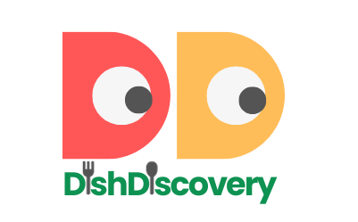
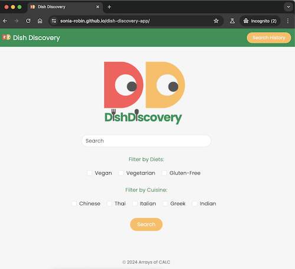

   

# Dish Discovery App

## Introduction
Imagine finding the perfect meal in an easy, fuss-free way, tailored to your preferences. Dish Discovery App transforms the way you explore tasty food by allowing you to search for recipes based on your specific wants and dietary needs. With a user-intuitive interface, simply enter your search and dietary preferences, and presto! You'll be presented with a curated selection of mouthwatering recipes, each featuring an inviting picture, ingredient list, and step-by-step instructions for hassle-free cooking. But that's not all, we take your experience to the next level by integrating curated YouTube videos alongside each recipe, ensuring your dish turns out perfect every time. Make mealtime fun again with Dish Discovery App – where creativity meets functionality, and every meal is hussle-free.



## Usage 
🔍 Search & Choose: 
Type in your cravings and dietary needs. 
Our app serves up 6 recipes that match your every whim. 
Each recipe is a clickable card.
👩‍🍳 Cooking Journey: 
Click the card to discover cooking time, servings, ingredients & step-by-step instructions.
🎥 Culinary Cinema: 
 Below the recipes, a clickable treasure trove of YouTube videos awaits. 
📚 Search Memory Lane: 
Worried about forgetting your favourites? Fear not, the search history is saved in local storage, accessible from the navbar.

## Usage 
🔍 Search & Choose: 
Type in your cravings and dietary needs. 
Our app serves up 6 recipes that match your every whim. 
Each recipe is a clickable card.
👩‍🍳 Cooking Journey: 
Click the card to discover cooking time, servings, ingredients & step-by-step instructions.
🎥 Culinary Cinema: 
 Below the recipes, a clickable treasure trove of YouTube videos awaits. 
📚 Search Memory Lane: 
Worried about forgetting your favourites? Fear not, the search history is saved in local storage, accessible from the navbar.

## Live Demo
https://sonia-robin.github.io/dish-discovery-app/

## Creators
Arrays of CALC:
- [Cassini-jones, Chantal](https://github.com/chantalcassinijones)
- [Adachi, Setsu](https://github.com/Setsu-Adachi)
- [Lee, Victor](https://github.com/vlee109)
- [Cervinkova, Sona](https://github.com/sonia-robin)

## Installation
From your shell or command line:
```console
git clone https://github.com/sonia-robin/dish-discovery-app
```
## License
Distributed under the MIT License, See LICENSE.txt for more info.

## Acknowledgements
[Bootstrap](https://getbootstrap.com),
[JSON](https://www.json.org/json-en.html),
[Spoonacular API](https://spoonacular.com/food-api),
[YouTube Data API](https://www.googleapis.com/youtube/v3/search?part=snippet&q=),
[Stack Overflow](https://stackoverflow.com),
[CSS-Tricks](https://css-tricks.com/),
[Google Fonts](https://fonts.google.com),
[Figma](https://www.figma.com),
[Canva](https://www.canva.com),


## Contributing
If you have any suggestions or improvements, feel free to open an [issue](https://github.com/sonia-robin/dish-discovery-app/issues) or create a [pull request](https://github.com/sonia-robin/dish-discovery-app/pulls). Contributions are welcome!

Enjoy Dish Discovery App. If you have any questions or need help, don't hesitate to reach out. Happy coding!

